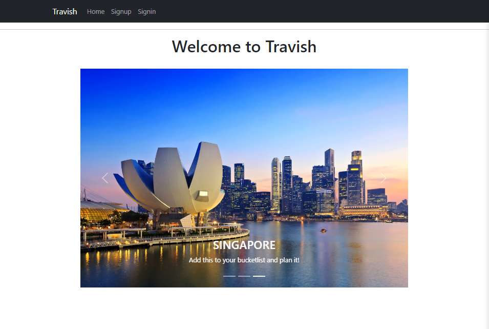
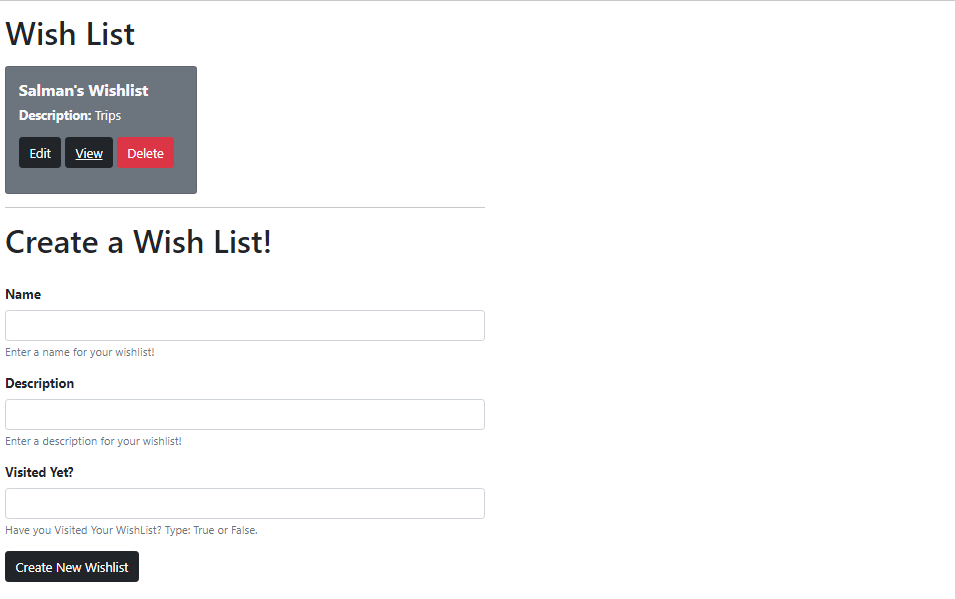
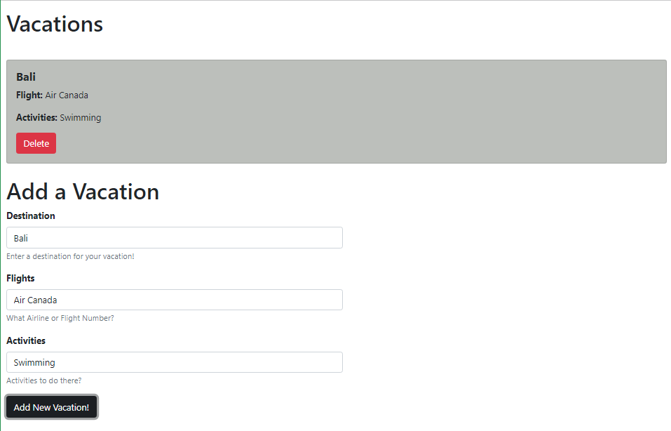

### Travish
Travish is a travel wish-list app for your planned vacations. It allows you to create multiple wish-lists with seperate vacations inside of it, to seperate all of your trips. Sign up to get full functionality!

### Screenshots

### Technologies Used

- HTML
- CSS
- JavaScript
- Node.js
- Express
- MongoDB Atlas
- React
- Heroku

### Getting Started
### [Travish App](https://travish.herokuapp.com/)
### [Trello Board](https://trello.com/b/vPOqG2Ac/travel)

### Future Enhancements
- include third party API's for flight data, images, and bookings
- style upgrades for UI
- travelled list to contain all places already visited
- recommending travel destinations based on an algorithm

